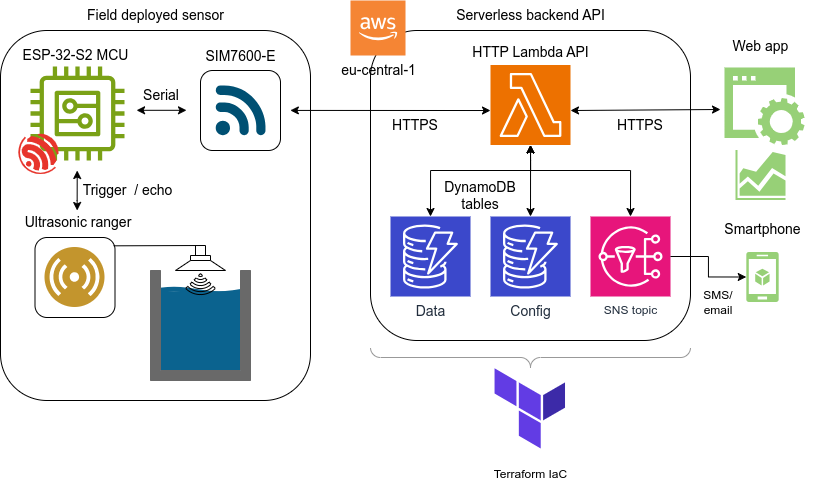
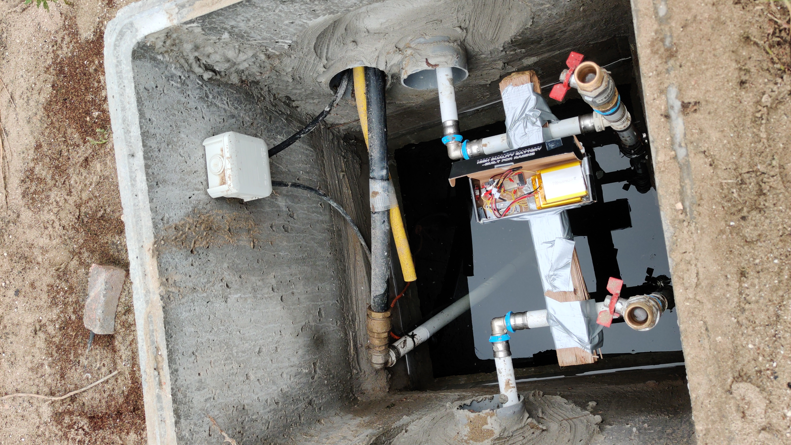
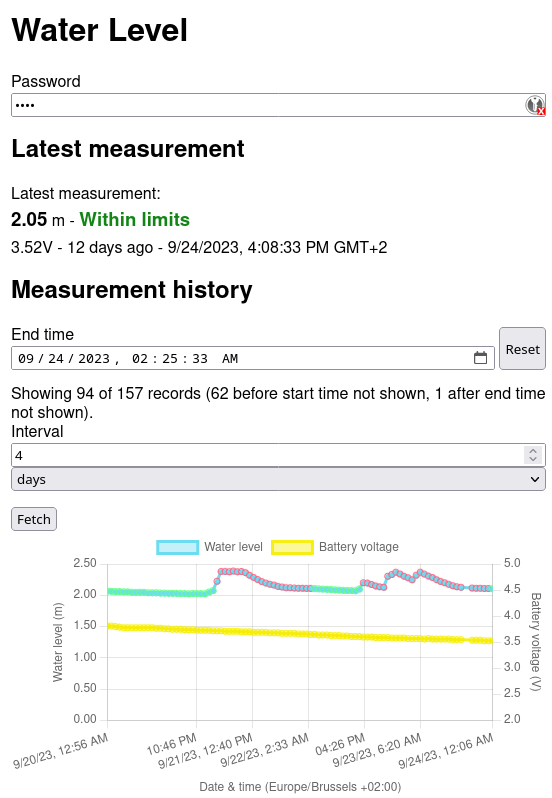
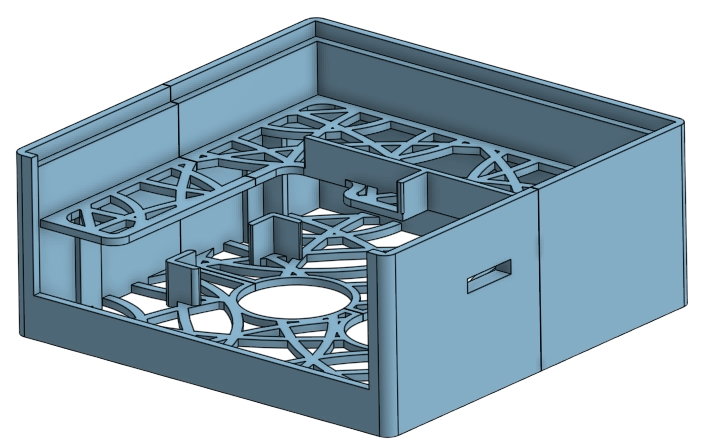

# Water Well Level 🛜📏🪣💦

**Ultrasonic IoT sensor to measure water level in a well**

My dad and I needed a way to ensure the water level in a rain water collection
well doesn't drop too low and that a pump actually uses the water as scheduled.
So, as a fun end-to-end IoT project, I put together a sensor, serverless
backend, and web UI.

## Sensor

The field-deployed sensor uses a
[hc-sr04](https://www.velleman.eu/products/view/?id=463692)-like ultrasonic
ranger to measure the water level from above. The measurements from this are
collected by an [ESP32-S2](https://www.sparkfun.com/products/17743) WiFi microcontroller.
Because we don't - yet - have WiFi available though, I also added a
[SIM7600E](https://simcom.ee/modules/lte/sim7600e/) cellular breakout board with
a prepaid SIM. The microcontroller is programmed in C++ using the
[PlatformIO](https://platformio.org/) toolchain. This entire system is powered by two 2500
mAh @ 3.7 V LiPo
batteries for a battery life of hopefully at least ~3 weeks @ 1
measurement/hour.

## Serverless backend

The sensor periodically sends its measurements and remaining battery capacity to
a serverless HTTPS API deployed to [AWS Lambda](https://aws.amazon.com/lambda/).
The lambda then saves these measurements to a
[DynamoDB](https://aws.amazon.com/dynamodb/) table and notifies an
[SNS](https://aws.amazon.com/sns/) topic for SMS and email notifications. It
also has an endpoint to query the table and to save and retrieve configuration
values. This cloud infrastructure is all defined and deployed as
[Terraform](https://www.terraform.io/) code.

## Web UI

Finally, a [Svelte](https://svelte.dev/) web app hosted on GitHub pages queries the lambda backend and presents the data in a graph using
[Chart.js](https://www.chartjs.org/). The app also allows you to configure the
sensor remotely.

## Images

<figure>
  
  <figcaption style="text-align: center; font-style: italic;">
    The sensor with white ultrasonic ranger, green SIM7600E cellular breakout board, and red ESP32-S2 microcontroller.
  </figcaption>
</figure>

<figure>
  
  <figcaption style="text-align: center; font-style: italic;">
    The water well with the sensor - for now - attached to pvc pipes.
  </figcaption>
</figure>

<figure>
  
  <figcaption style="text-align: center; font-style: italic;">
    The web app showing the water level and battery voltage over time.
  </figcaption>
</figure>

<figure>
  
  <figcaption style="text-align: center; font-style: italic;">
    CAD model of the case for the sensor with snap close tabs. I haven't been able to produce a proper print yet due to bed adhesion issues.
  </figcaption>
</figure>
