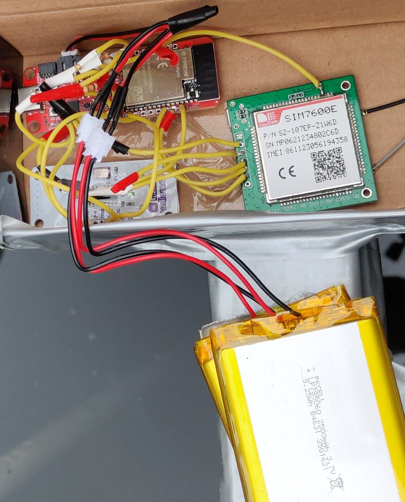
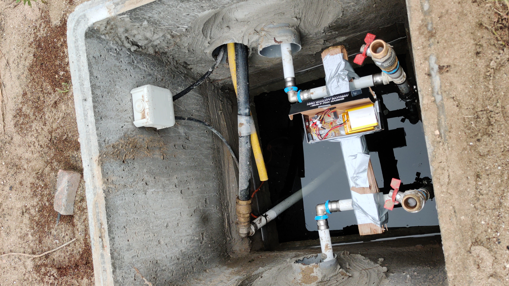
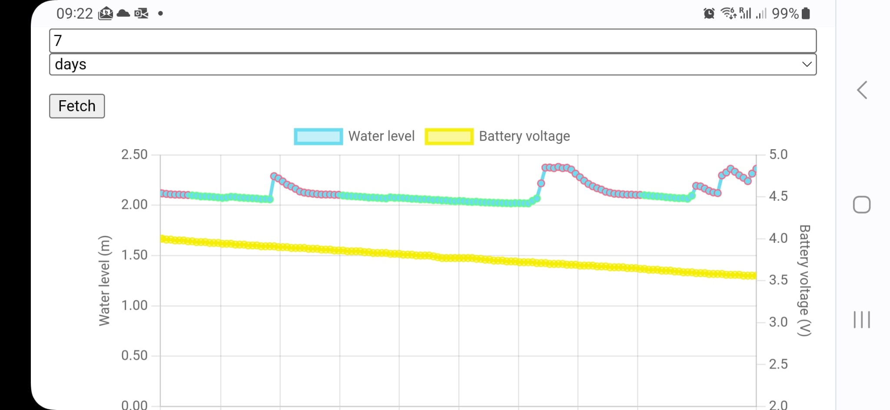

# Water Well Level 🛜📏🪣💦

**Ultrasonic IoT sensor to measure water level in a well**

My dad and I needed a way to ensure the water level in a rain water collection well doesn't drop too low and that a pump actually uses the water as scheduled. So, as a fun end-to-end IoT project, I put together a sensor, serverless backend, and web UI.

The field-deployed sensor uses a [hc-sr04-like](https://www.velleman.eu/products/view/?id=463692) ultrasonic ranger to measure the water level from above. The measurements from this are collected by a [ESP32-S2](https://www.sparkfun.com/products/17743) WiFi-MCU. Because we don't - yet - have WiFi available though, I also added a [SIM7600E](https://simcom.ee/modules/lte/sim7600e/) cellular breakout board with a prepaid SIM. This entire system is powered by two 2500 mAh @ 3.7 V LiPo batteries for a battery life of hopefully at least ~3 weeks @ 1 measurement/hour.

The sensor periodically sends its measurements to a serverless HTTPS API deployed to AWS Lambda. The lambda then saves these measurements to a DynamoDB table. It also has an endpoint to query this table and to save and retrieve configuration values.

A GitHub pages hosted, static [Svelte](https://svelte.dev/) web app then queries these endpoints and results the data in a graph using [Chart.js](https://www.chartjs.org/).

All the cloud infrastructure is defined and deployed as [Terraform](https://www.terraform.io/) code.

